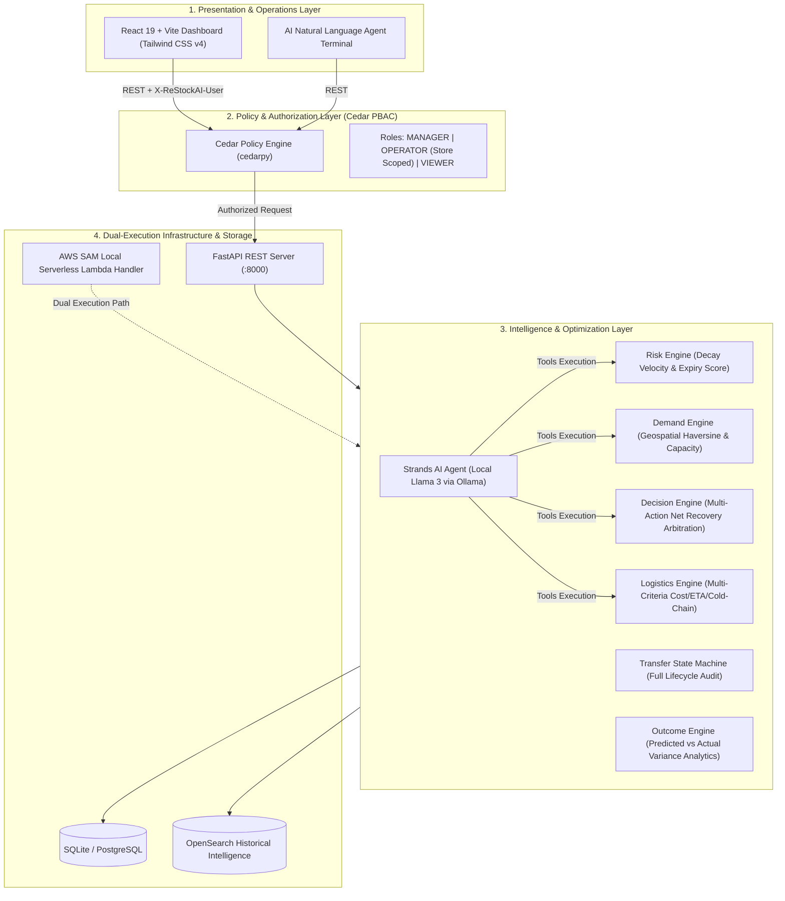

# ReStockAI ⚡

> **Autonomous Inventory Recovery & Network Optimization Platform for Quick-Commerce and Multi-Location Retail**

[](https://www.python.org/)
[](https://fastapi.tiangolo.com/)
[](https://react.dev/)
[](https://vitejs.dev/)
[](https://tailwindcss.com/)
[](https://www.cedarpolicy.com/)
[](https://aws.amazon.com/serverless/sam/)
[](https://ollama.com/)
[](#-testing--quality-assurance)
[](LICENSE)

---

## 📌 Executive Summary

Every year, multi-location retail and quick-commerce dark-store networks lose over **$100 Billion** to unsalable inventory, perishable expiration, and uncoordinated emergency markdowns. Traditional ERPs and inventory systems operate in static silos: store managers don't know that a product expiring in 48 hours at Store A could be sold at full price within 12 hours at Store B just 6 kilometers away.

**ReStockAI** transforms inventory loss from an inevitable write-off into an active profit-recovery channel. By coupling **100% deterministic economic and geospatial engines** with an **autonomous LLM orchestration agent** and **cryptographic Cedar policy controls**, ReStockAI automatically identifies at-risk SKUs, calculates the single highest net-recovery action, selects optimal cold-chain logistics partners, and dispatches transfers across dark stores in real time.

---

## 🏛️ System Architecture

ReStockAI is architected in four clean, decoupled layers separating deterministic business logic, authorization, AI reasoning, and presentation:



---

## 🗺️ Complete 12-Phase Implementation Roadmap

ReStockAI has been engineered across **12 comprehensive milestones**, all fully completed and integrated:

| Phase | Milestone | Scope & Deliverables | Status |
|---|---|---|:---:|
| **Phase 1** | **Deterministic Risk Engine** | Rule-based inventory risk calculation, sales velocity decay, and expiry economic loss quantification. | ✅ **Complete** |
| **Phase 2** | **Demand Intelligence Engine** | Geospatial Haversine store discovery, cold-chain validation, destination capacity buffer gating (80% safety fill). | ✅ **Complete** |
| **Phase 3** | **Recovery Decision Engine** | Real-time economic arbitration across 6 actions: Transfer, Discount, Bundle, Promote, Return, Dispose. | ✅ **Complete** |
| **Phase 4** | **Logistics Partner Selection** | Multi-criteria logistics scoring: distance-based freight cost, transit ETA, headroom capacity, cold-chain compliance. | ✅ **Complete** |
| **Phase 5** | **Transfer Lifecycle State Machine** | Strict state machine managing end-to-end transit states (`CREATED` → `APPROVED` → `ASSIGNED` → `IN_TRANSIT` → `COMPLETED`). | ✅ **Complete** |
| **Phase 6** | **Outcome Analytics & Feedback** | Post-recovery tracking comparing predicted vs. actual revenue, sell-through rates, and variance reconciliation. | ✅ **Complete** |
| **Phase 7** | **Historical Intelligence Layer** | OpenSearch integration indexing past transfer performance for pattern discovery and retrieval. | ✅ **Complete** |
| **Phase 8** | **AWS SAM Serverless Architecture** | AWS Serverless Application Model (SAM) local Lambda integration, ensuring identical parity between API and serverless handlers. | ✅ **Complete** |
| **Phase 9** | **Strands AI Orchestration Agent** | Local LLM intelligence (Llama 3 via Ollama) with deterministic guardrails and live engine tool calling. | ✅ **Complete** |
| **Phase 10** | **Modern Operations Dashboard** | High-performance React 19 war room interface with real-time KPI metrics, risk heatmaps, and action manifests. | ✅ **Complete** |
| **Phase 11** | **Automated Workflow Orchestrator** | One-click end-to-end execution pipeline from risk detection to transfer creation and outcome finalization. | ✅ **Complete** |
| **Phase 12** | **Cedar Policy-Based Access Control** | Cryptographic authorization layer using open-source Cedar (`cedarpy`), securing operations by user role and store scope. | ✅ **Complete** |

---

## 🧮 Mathematical & Economic Formulations

ReStockAI eliminates subjective guesswork with transparent, deterministic algorithms.

### 1. Dynamic Inventory Risk Score ($S_{\text{risk}}$)
Evaluates remaining shelf life against historical sales velocity ($v_{\text{7d}}$) and current stock ($Q$):

$$\Delta t = \max(t_{\text{expiry}} - t_{\text{today}}, 0)$$

$$Q_{\text{expected\_sales}} = v_{\text{7d}} \times \Delta t$$

$$Q_{\text{at\_risk}} = \min(\max(Q - Q_{\text{expected\_sales}}, 0), Q)$$

$$R_{\%} = \frac{Q_{\text{at\_risk}}}{Q} \times 100$$

$$\text{Urgency Factor } (U) = \begin{cases} 1.5 & \text{if } \Delta t \le 3 \text{ days} \\ 1.2 & \text{if } \Delta t \le 7 \text{ days} \\ 1.0 & \text{otherwise} \end{cases}$$

$$S_{\text{risk}} = \min(R_{\%} \times U, 100.0)$$

Classification: **CRITICAL** ($S_{\text{risk}} \ge 80$ or $\Delta t \le 2$), **HIGH** ($S_{\text{risk}} \ge 50$), **MEDIUM** ($S_{\text{risk}} \ge 20$), **LOW** ($S_{\text{risk}} < 20$).

---

### 2. Geospatial Haversine Distance & Usable Absorption Capacity
Ensures products are only moved within feasible transfer radii ($D_{\max} = 15\text{ km}$) and destinations can absorb units before expiry:

$$d = 2 R \arcsin \left( \sqrt{\sin^2\left(\frac{\Delta \phi}{2}\right) + \cos(\phi_1)\cos(\phi_2)\sin^2\left(\frac{\Delta \lambda}{2}\right)} \right)$$

$$C_{\text{usable}} = \max(v_{\text{dest\_7d}} \times \Delta t - Q_{\text{dest}}, 0) \times 0.80$$

$$\text{Recommended Transfer Quantity} = \min(Q_{\text{at\_risk}}, \lfloor C_{\text{usable}} \rfloor)$$

---

### 3. Net Economic Recovery Arbitration
The Decision Engine evaluates all 6 recovery channels simultaneously and strictly chooses the action yielding the **highest expected net recovery**:

$$\text{Action}^* = \arg\max_{a \in \mathcal{A}} \left( \text{Net Recovery}(a) \right)$$

Where Net Recovery is calculated as:

| Action | Net Economic Recovery Formula | Operational Complexity Rank |
|---|---|:---:|
| **`TRANSFER`** | $(Q_{\text{rec}} \times P_{\text{sell}}) - C_{\text{logistics}} - (Q_{\text{rec}} \times C_{\text{handling}})$ | 5 |
| **`DISCOUNT`** | $Q_{\text{at\_risk}} \times (P_{\text{sell}} \times 0.70) \times 0.80$ | 1 |
| **`BUNDLE`** | $Q_{\text{at\_risk}} \times (P_{\text{sell}} \times 0.85) \times 0.60 - (Q_{\text{at\_risk}} \times C_{\text{bundle\_handling}})$ | 3 |
| **`PROMOTE`** | $(Q_{\text{uplift}} \times P_{\text{sell}}) - C_{\text{promo\_handling}}$ | 2 |
| **`RETURN`** | $(Q_{\text{at\_risk}} \times P_{\text{supplier\_refund}}) - C_{\text{return\_logistics}} - C_{\text{return\_handling}}$ | 4 |
| **`DISPOSE`** | $-(Q_{\text{at\_risk}} \times C_{\text{disposal\_fee}})$ | 6 |
| **`NO_ACTION`** | $0.00$ *(Risk below actionable threshold)* | 7 |

*Tie-breaking order: (1) Highest Net Recovery $\rightarrow$ (2) Highest Gross Recovered Value $\rightarrow$ (3) Lowest Operational Complexity.*

---

### 4. Multi-Criteria Logistics Scoring
Ranks freight and courier partners based on cost efficiency (50%), ETA speed (30%), and fleet headroom (20%):

$$S_{\text{logistics}} = 0.50 \cdot S_{\text{cost}} + 0.30 \cdot S_{\text{eta}} + 0.20 \cdot S_{\text{capacity}}$$

Subject to hard constraints:
$$\text{Supports Cold Chain}(\text{Partner}) \ge \text{Requires Cold Chain}(\text{SKU})$$
$$\text{Vehicle Capacity Headroom} \ge \text{Transfer Quantity}$$

---

## 🔐 Security & Governance: Cedar Authorization (Phase 12)

ReStockAI implements zero-trust authorization using the open-source **Cedar Policy Language** (`cedarpy`). Every mutating API endpoint is guarded against unauthorized access:

```cedar
// 1. Full Network Management
permit (
    principal in ReStockAI::Role::"MANAGER",
    action,
    resource
);

// 2. Store-Scoped Operator Isolation
permit (
    principal,
    action in [
        ReStockAI::Action::"ViewRisk",
        ReStockAI::Action::"CreateTransfer",
        ReStockAI::Action::"ExecuteWorkflow"
    ],
    resource
)
when {
    principal.role == "OPERATOR" &&
    resource.store_id == principal.store_scope
};

// 3. Immutability Protection: Cannot alter finalized transfers
forbid (
    principal,
    action in [ReStockAI::Action::"CancelTransfer", ReStockAI::Action::"CompleteTransfer"],
    resource
)
when {
    resource.status == "COMPLETED"
};
```

---

## 🖥️ Live User Interface & Feature Tour

The frontend is built with **React 19, TypeScript, Vite, and Tailwind CSS v4**, delivering a high-density, real-time command center:

### 1. Operations War Room Dashboard (`/`)
- Real-time network telemetry: **At-Risk Units ($)**, **Potential Recovery ($)**, **Active Transit Orders**, and **Reconciled Value**.
- Critical inventory countdown cards showing immediate expiry risks across the network.
- Live manifest of active transfers and finalized financial outcomes.

### 2. Multi-Store Risk Network Matrix (`/risk`)
- Multi-dimensional inventory risk ledger filterable by risk level (`CRITICAL`, `HIGH`, `MEDIUM`, `LOW`).
- Displays stock quantity, days remaining, daily sales velocity, and total capital at risk.

### 3. Recovery Decision Arbitration (`/decisions`)
- Full visual comparison of all 6 recovery actions for each at-risk SKU.
- Displays economic breakdown: Gross Value, Logistics Freight, Handling Surcharges, and Net Recovery.
- One-click transfer dispatch directly from the decision card.

### 4. Transfer Dispatch & Manifest (`/transfers`)
- Real-time status manifest for inventory movements (`CREATED`, `APPROVED`, `ASSIGNED`, `IN_TRANSIT`, `COMPLETED`).
- Detailed transfer tracking with route maps, assigned logistics partner, and cold-chain compliance badges.

### 5. Strands AI Natural-Language Agent Terminal (`/agent`)
- Integrated chat terminal connected to a local LLM (e.g. Llama 3) via Strands Agents.
- **Zero-Hallucination Deterministic Guardrails**: The agent does not invent numbers. It executes live engine tools (`get_inventory_risk`, `find_destination_matches`, `evaluate_recovery_options`, `optimize_logistics`), presents verified engine figures, and displays tool badges.

---

## 🚀 Quick Start Guide

### Prerequisites
- **Python 3.11+**
- **Node.js v18+ & npm**
- **Ollama** (optional, for local LLM assistant): [https://ollama.com/](https://ollama.com/)

---

### Step 1: Clone and Set Up Virtual Environment

```bash
# Clone the repository
git clone -b main https://github.com/Manish-N-2006/Restock_AI.git
cd Restock_AI

# Create and activate Python virtual environment
python -m venv venv

# Windows (PowerShell)
.\venv\Scripts\activate

# macOS / Linux
source venv/bin/activate

# Install backend dependencies
pip install -r backend/requirements.txt
```

---

### Step 2: Seed the Local SQLite Database

Populate the database with synthetic retail stores, logistics partners, and multi-store inventory:

```bash
python -m backend.app.services.data_loader --reset
```

---

### Step 3: Launch the Backend API

```bash
uvicorn backend.app.main:app --host 127.0.0.1 --port 8000 --reload
```

- **API Base URL**: `http://127.0.0.1:8000`
- **Interactive Swagger Documentation**: [http://127.0.0.1:8000/docs](http://127.0.0.1:8000/docs)
- **Health Check**: [http://127.0.0.1:8000/health](http://127.0.0.1:8000/health)

*Note: Protected endpoints require the development authorization header: `X-ReStockAI-User: manager`.*

---

### Step 4: Start the Local AI Assistant (Optional)

In a separate terminal, ensure Ollama is serving your local model (e.g. `llama3:latest` or `llama3.1`):

```bash
ollama serve
```

---

### Step 5: Launch the Frontend Web Dashboard

In a new terminal window:

```bash
cd frontend

# Install dependencies
npm install

# Start Vite development server
npm run dev
```

Open your browser at **[http://localhost:5173](http://localhost:5173)** to access the ReStockAI command center.

---

## 🧪 Testing & Quality Assurance

ReStockAI features an exhaustive automated test suite covering all services, APIs, security policies, and edge-case failure modes:

```bash
# Run the complete pytest test suite
$env:PYTHONPATH=".;backend"; pytest backend/tests/ -v

# Validate Cedar authorization policies
python -m backend.app.authorization.validate
```

### Test Coverage Highlights:
- `test_risk_engine.py`: Validates sales decay, urgency multipliers, and risk level thresholds.
- `test_demand_engine.py`: Validates Haversine distance calculations, cold-chain gating, and capacity buffers.
- `test_decision_engine.py`: Validates economic arbitration across all 6 recovery actions and deterministic tie-breaking.
- `test_logistics_engine.py`: Validates multi-criteria scoring, cold-chain checks, and freight cost estimates.
- `test_transfer_engine.py`: Validates state transitions, illegal state transitions, and idempotency.
- `test_authorization_api.py`: Validates Cedar PBAC authorization, store scoping, and explicit forbidden mutations.
- `test_agent_service.py`: Validates LLM tool-calling guardrails and deterministic fallback integration.

---

## 📡 API Reference & Example Requests

### 1. Retrieve Network Inventory Risk Summary
```bash
curl -X GET "http://127.0.0.1:8000/api/risk/summary" \
     -H "X-ReStockAI-User: manager"
```

### 2. Get Optimal Recovery Decision for a SKU
```bash
curl -X GET "http://127.0.0.1:8000/api/decision/YOG-001?store_id=STORE_A" \
     -H "X-ReStockAI-User: manager"
```

### 3. Query Best Matched Destination Store
```bash
curl -X GET "http://127.0.0.1:8000/api/demand/best-match/YOG-001?source_store_id=STORE_A" \
     -H "X-ReStockAI-User: manager"
```

### 4. Query AI Orchestration Agent
```bash
curl -X POST "http://127.0.0.1:8000/api/agent/ask" \
     -H "Content-Type: application/json" \
     -H "X-ReStockAI-User: manager" \
     -d '{"question": "What should I do with YOG-001 at STORE_A?"}'
```

### 5. Execute Full Recovery Workflow (One-Click Autonomous Loop)
```bash
curl -X POST "http://127.0.0.1:8000/api/workflow/execute" \
     -H "Content-Type: application/json" \
     -H "X-ReStockAI-User: manager" \
     -d '{
       "sku_id": "YOG-001",
       "source_store_id": "STORE_A",
       "actual_units_sold": 42,
       "actual_recovered_value": 6720.0,
       "actual_logistics_cost": 320.0,
       "actual_handling_cost": 50.0
     }'
```

---

## 🏆 Why ReStockAI Wins

1. **True End-to-End Execution**: Not a mock interface or simple wrapper. ReStockAI implements a complete loop from raw data ingestion to risk scoring, geospatial store matching, economic arbitration, logistics dispatch, and post-transfer outcome reconciliation.
2. **100% Deterministic Financial Integrity**: Unlike unconstrained LLM solutions that hallucinate dollar values, ReStockAI's financial calculations are completely deterministic and mathematically provable. The AI agent acts strictly as an explainable orchestration layer.
3. **Enterprise-Grade Authorization (Cedar PBAC)**: Implements Amazon's open-source Cedar language (`cedarpy`), providing formal policy separation between identity, permissions, and business logic.
4. **Dual-Path Architecture (FastAPI + AWS SAM)**: Production-ready hybrid design supporting both containerized microservice execution and serverless AWS Lambda invocation with identical business logic parity.
5. **Production-Ready Modern UI**: Built with React 19, Vite, and Tailwind CSS v4, providing a real-time command center designed for dark-store network dispatchers.

---

## 📄 License

This project is licensed under the MIT License. See the [LICENSE](LICENSE) file for details.
